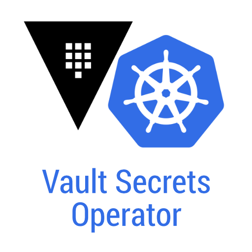
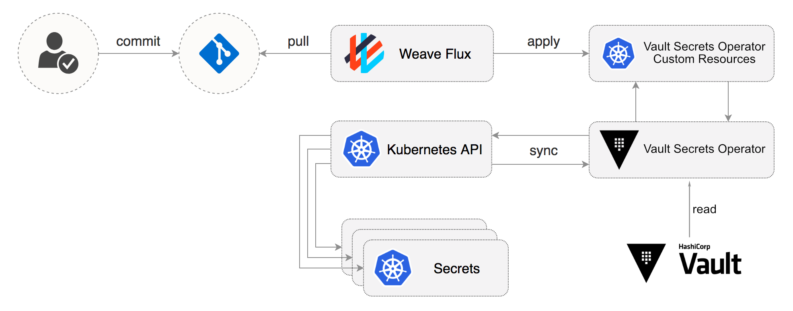

<div align="center">
  
  <br><br>

  Create Kubernetes secrets from Vault for a secure GitOps based workflow.

  
</div>

The **Vault Secrets Operator** creates Kubernetes secrets from Vault. The idea behind the Vault Secrets Operator is to manage secrets in Kubernetes cluster using a secure GitOps based workflow. For more information about a secure GitOps based workflow I recommend the article ["Managing Secrets in Kubernetes"](https://www.weave.works/blog/managing-secrets-in-kubernetes) from [Weaveworks](https://www.weave.works). With the help of the Vault Secrets Operator you can commit your secrets to your git repository using a custom resource. If you apply these secrets to your Kubernetes cluster the Operator will lookup the real secret in Vault and creates the corresponding Kubernetes secret. If you are using something like [Sealed Secrets](http://github.com/bitnami-labs/sealed-secrets) for this workflow the Vault Secrets Operator can be used as replacement for this.

## Installation

The Vault Secrets Operator can be installed via Helm. A list of all configurable values can be found [here](./charts/README.md). The chart assumes a vault server running at `http://vault:8200`, but can be overidden by specifying `--set vault.address=https://vault.example.com`

```sh
helm repo add ricoberger https://ricoberger.github.io/helm-charts
helm repo update

helm upgrade --install vault-secrets-operator ricoberger/vault-secrets-operator
```

### Prepare Vault

The Vault Secrets Operator supports the **KV Secrets Engine - Version 1** and **KV Secrets Engine - Version 2**. To create a new secret engine under a path named `kvv1` and `kvv2`, you can run the following command:

```sh
vault secrets enable -path=kvv1 -version=1 kv
vault secrets enable -path=kvv2 -version=2 kv
```

After you have enabled the secret engine, create a new policy for the Vault Secrets Operator. The operator only needs read access to the paths you want to use for your secrets. To create a new policy with the name `vault-secrets-operator` and read access to the `kvv1` and `kvv2` path, you can run the following command:

```sh
cat <<EOF | vault policy write vault-secrets-operator -
path "kvv1/*" {
  capabilities = ["read"]
}

path "kvv2/data/*" {
  capabilities = ["read"]
}
EOF
```

To access Vault the operator can choose between the **[Token Auth Method](https://www.vaultproject.io/docs/auth/token.html)** or the **[Kubernetes Auth Method](https://www.vaultproject.io/docs/auth/kubernetes.html)**. In the next sections you found the instructions to setup Vault for the two authentication methods.

#### Token Auth Method

To use Token auth method for the authentication against the Vault API, you need to create a token. A token with the previously created policy can be created as follows:

```sh
vault token create -period=24h -policy=vault-secrets-operator
```

To use the created token you need to pass the token as an environment variable to the operator. For security reasons the operator only supports the passing of environment variables via a Kubernetes secret. The secret with the keys `VAULT_TOKEN` and `VAULT_TOKEN_LEASE_DURATION` (as well as optional keys `VAULT_TOKEN_RENEWAL_INTERVAL` and `VAULT_TOKEN_RENEWAL_RETRY_INTERVAL` to control timings for token renewals, if required) can be created with the following command:

```sh
export VAULT_TOKEN=
export VAULT_TOKEN_LEASE_DURATION=86400

cat <<EOF | kubectl apply -f -
apiVersion: v1
kind: Secret
metadata:
  name: vault-secrets-operator
type: Opaque
data:
  VAULT_TOKEN: $(echo -n "$VAULT_TOKEN" | base64)
  VAULT_TOKEN_LEASE_DURATION: $(echo -n "$VAULT_TOKEN_LEASE_DURATION" | base64)
EOF
```

This creates a secret named `vault-secrets-operator`. To use this secret in the Helm chart modify the `values.yaml` file as follows:

```yaml
environmentVars:
  - name: VAULT_TOKEN
    valueFrom:
      secretKeyRef:
        name: vault-secrets-operator
        key: VAULT_TOKEN
  - name: VAULT_TOKEN_LEASE_DURATION
    valueFrom:
      secretKeyRef:
        name: vault-secrets-operator
        key: VAULT_TOKEN_LEASE_DURATION
```

#### Kubernetes Auth Method

The recommended way to authenticate is the Kubernetes auth method, which requires a service account for communication between Vault and the Vault Secrets Operator. If you installed the operator via Helm this service account is created for you. The name of the created service account is `vault-secrets-operator`. Use the following commands to set the environment variables for the activation of the Kubernetes auth method:

```sh
export VAULT_SECRETS_OPERATOR_NAMESPACE=$(kubectl get sa vault-secrets-operator -o jsonpath="{.metadata.namespace}")
export VAULT_SECRET_NAME=$(kubectl get sa vault-secrets-operator -o jsonpath="{.secrets[*]['name']}")
export SA_JWT_TOKEN=$(kubectl get secret $VAULT_SECRET_NAME -o jsonpath="{.data.token}" | base64 --decode; echo)
export SA_CA_CRT=$(kubectl get secret $VAULT_SECRET_NAME -o jsonpath="{.data['ca\.crt']}" | base64 --decode; echo)
export K8S_HOST=$(kubectl config view --minify -o jsonpath='{.clusters[0].cluster.server}')

# Verify the environment variables
env | grep -E 'VAULT_SECRETS_OPERATOR_NAMESPACE|VAULT_SECRET_NAME|SA_JWT_TOKEN|SA_CA_CRT|K8S_HOST'
```

Enable the Kubernetes auth method at the default path (`auth/kubernetes`) and finish the configuration of Vault:

```sh
vault auth enable kubernetes

# Tell Vault how to communicate with the Kubernetes cluster
vault write auth/kubernetes/config \
  token_reviewer_jwt="$SA_JWT_TOKEN" \
  kubernetes_host="$K8S_HOST" \
  kubernetes_ca_cert="$SA_CA_CRT"

# Create a role named, 'vault-secrets-operator' to map Kubernetes Service Account to Vault policies and default token TTL
vault write auth/kubernetes/role/vault-secrets-operator \
  bound_service_account_names="vault-secrets-operator" \
  bound_service_account_namespaces="$VAULT_SECRETS_OPERATOR_NAMESPACE" \
  policies=vault-secrets-operator \
  ttl=24h

# If you're running Vault inside kubernetes, you can alternatively exec into any Vault pod and run this...
# In some bare-metal k8s setups this method is necessary.
# vault write auth/kubernetes/config \
#   token_reviewer_jwt="$(cat /var/run/secrets/kubernetes.io/serviceaccount/token)" \
#   kubernetes_host=https://${KUBERNETES_PORT_443_TCP_ADDR}:443 \
#   kubernetes_ca_cert=@/var/run/secrets/kubernetes.io/serviceaccount/ca.crt
```

When you deploy the Vault Secrets Operator via Helm chart you have to set the `vault.authMethod` property to `kubernetes` in the `values.yaml` file, to use the Kubernetes auth method instead of the default Token auth methods.

```yaml
vault:
  authMethod: kubernetes
```

#### AppRole Auth Method

To use AppRole auth method for the authentication against the Vault API, you need to create a new AppRole.


```sh
# Enable AppRole auth method:
vault auth enable approle

# AppRole with the previously created policy can be created as follows:
vault write auth/approle/role/vault-secrets-operator \
  token_policies=vault-secrets-operator

# Get AppRole ID:
vault read auth/approle/role/vault-secrets-operator/role-id

# Create a new secret for AppRole:
vault write -f auth/approle/role/vault-secrets-operator/secret-id
```

Use the following commands to set the environment variables for the activation of the AppRole auth method:
```shell
export VAULT_AUTH_METHOD=approle
export VAULT_ROLE_ID=
export VAULT_SECRET_ID=
export VAULT_TOKEN_MAX_TTL=86400
```

When you deploy the Vault Secrets Operator via Helm chart you have to set the `vault.authMethod` property to `approle` in the `values.yaml` file, to use the AppRole auth method instead of the default Token auth method.

```yaml
vault:
  authMethod: approle
```

## Usage

Create two Vault secrets `example-vaultsecret`:

```sh
vault kv put kvv1/example-vaultsecret foo=bar hello=world

vault kv put kvv2/example-vaultsecret foo=bar
vault kv put kvv2/example-vaultsecret hello=world
vault kv put kvv2/example-vaultsecret foo=bar hello=world
```

Deploy the custom resource `kvv1-example-vaultsecret` to your Kubernetes cluster:

```yaml
apiVersion: ricoberger.de/v1alpha1
kind: VaultSecret
metadata:
  name: kvv1-example-vaultsecret
spec:
  keys:
    - foo
  path: kvv1/example-vaultsecret
  type: Opaque
```

The Vault Secrets Operator creates a Kubernetes secret named `kvv1-example-vaultsecret` with the type `Opaque` from this CR:

```yaml
apiVersion: v1
data:
  foo: YmFy
kind: Secret
metadata:
  labels:
    created-by: vault-secrets-operator
  name: kvv1-example-vaultsecret
type: Opaque
```

You can also omit the `keys` spec to create a Kubernetes secret which contains all keys from the Vault secret:

```yaml
apiVersion: v1
data:
  foo: YmFy
  hello: d29ybGQ=
kind: Secret
metadata:
  labels:
    created-by: vault-secrets-operator
  name: kvv1-example-vaultsecret
type: Opaque
```

To deploy a custom resource `kvv2-example-vaultsecret`, which uses the secret from the KV Secrets Engine - Version 2 you can use the following:

```yaml
apiVersion: ricoberger.de/v1alpha1
kind: VaultSecret
metadata:
  name: kvv2-example-vaultsecret
spec:
  path: kvv2/example-vaultsecret
  type: Opaque
```

The Vault Secrets Operator will create a secret which looks like the following:

```yaml
apiVersion: v1
data:
  foo: YmFy
  hello: d29ybGQ=
kind: Secret
metadata:
  labels:
    created-by: vault-secrets-operator
  name: kvv2-example-vaultsecret
type: Opaque
```

For secrets using the KVv2 secret engine you can also specify the version of the secret you want to deploy:

```yaml
apiVersion: ricoberger.de/v1alpha1
kind: VaultSecret
metadata:
  name: kvv2-example-vaultsecret
spec:
  path: kvv2/example-vaultsecret
  type: Opaque
  version: 2
```

The resulting Kubernetes secret will be:

```yaml
apiVersion: v1
data:
  hello: d29ybGQ=
kind: Secret
metadata:
  labels:
    created-by: vault-secrets-operator
  name: kvv2-example-vaultsecret
type: Opaque
```

The `spec.type` and `spec.keys` fields are handled in the same way for both versions of the KV secret engine. The `spec.version` field is only processed, when the secret is saved under a KVv2 secret engine. If you specified the `VAULT_RECONCILIATION_TIME` environment variable with a value greater than `0` every secret is reconciled after the given time. This means, when you do not specify `spec.version`, the Kubernetes secret will be automatically updated if the Vault secret changes.

The binary data stored in vault requires [base64 encoding](https://github.com/hashicorp/vault/issues/1423#issuecomment-219525845). the
`spec.isBinary` can be used to prevent such data get base64 encoded again when store as secret in k8s.

For example, let's set `foo` to the `bar` in base64 encoded format (i.e. YmFyCg==).

```sh
vault kv put kvv1/example-vaultsecret foo=YmFyCg==
```

You can specify `spec.isBinary` to indicate this is a binary data which is already in base64 encoded format:

```yaml
apiVersion: ricoberger.de/v1alpha1
kind: VaultSecret
metadata:
  name: kvv1-example-vaultsecret
spec:
  keys:
    - foo
  isBinary: true
  path: kvv1/example-vaultsecret
  type: Opaque
```

The resulting Kubernetes secret will be:

```yaml
apiVersion: v1
data:
  foo: YmFyCg==
kind: Secret
metadata:
  labels:
    created-by: vault-secrets-operator
  name: kvv1-example-vaultsecret
type: Opaque
```

The value for `foo` stays as `YmFyCg==` which does not get base64 encoded again.

It is also possible to change the default reconciliation strategy from `Replace` to `Merge` via the `reconcileStrategy` key in the CRD. For the default `Replace` strategy the complete secret is replaced. If you have an existing secret you can choose the `Merge` strategy to add the keys from Vault to the existing secret.

### Using templated secrets

When straight-forward secrets are not sufficient, and the target secrets need to be formatted in a certain way, you can use basic templating to format the secrets. There are multiple uses for this:

* Generate URIs which contain secrets
* Format secrets in a specific way, for example when using the [Helm Operator](https://docs.fluxcd.io/projects/helm-operator/) which [can use secrets as a source](https://docs.fluxcd.io/projects/helm-operator/en/stable/helmrelease-guide/values/#secrets) for its Helm chart parameterisation, but they have to be in YAML format wrapped inside a secret, like [`secretGenerator`](https://kubernetes-sigs.github.io/kustomize/api-reference/kustomization/secretegenerator/) from [Kustomize](https://kustomize.io) also generates.

To do this, specify keys under `spec.templates`, containing a valid template string.
When `templates` is defined, the standard generation of secrets is disabled, and only the defined templates will be generated.

The templating uses the standard Go templating engine, also used in tools such as [Helm](https://helm.sh) or [Gomplate](https://gomplate.ca). The main differentiator here is that the `` delimiters are used to prevent conflicts with standard Go templating tools such as Helm, which use `{{` and `}}` for this.

The available functions during templating are the set offered by the [Sprig library](http://masterminds.github.io/sprig/) (similar to [Helm](https://helm.sh/docs/chart_template_guide/function_list/), but different from [Gomplate](https://docs.gomplate.ca)), excluding the following functions for security-reasons or their non-idempotent nature to avoid reconciliation problems:

* `genPrivateKey`
* `genCA`
* `genSelfSignedCert`
* `genSignedCert`
* `htpasswd`
* `getHostByName`
* Random functions
* Date/time functionality
* Environment variable functions (for security reasons)

#### Templating context

The context available in the templating engine contains the following items:

* `.Secrets`: Map with all the secrets fetched from vault. Key = secret name, Value = secret value
* `.Vault`: Contains misc info about the Vault setup
  * `.Vault.Address`: configured address of the Vault instance
  * `.Vault.Path`: path of the Vault secret that was fetched
* `.Namespace`: Namespace where the custom resource instance was deployed.
* `.Labels`: access to the labels of the custom resource instance
* `.Annotations`: access to the annotations of the custom resource instance

#### Examples

An example of a URI formatting secret:

```yaml
apiVersion: ricoberger.de/v1alpha1
kind: VaultSecret
metadata:
  name: kvv1-example-vaultsecret
  annotations:
    redisdb: "0"
spec:
  keys:
    - foo
    - bar
  path: kvv1/example-vaultsecret
  templates:
    fooUri: "https://user:@.somesite.tld/api"
    barUri: "redis://@redis/"
  type: Opaque
```

The resulting secret will look like:

```yaml
apiVersion: v1
data:
  fooUri: aHR0cHM6Ly91c2VyOmZvb0BuYW1lc3BhY2UuLnNvbWVzaXRlLnRsZC9hcGkK
  barUri: cmVkaXM6Ly9iYXJAcmVkaXMvMAo=
kind: Secret
metadata:
  labels:
    created-by: vault-secrets-operator
  name: kvv1-example-vaultsecret
type: Opaque
```

This is a more advanced example for a secret that can be used by [HelmOperator](https://docs.fluxcd.io/projects/helm-operator/) as [`valuesFrom[].secretKeyRef`](https://docs.fluxcd.io/projects/helm-operator/en/stable/helmrelease-guide/values/#secrets):

```yaml
apiVersion: ricoberger.de/v1alpha1
kind: VaultSecret
metadata:
  name: kvv1-example-vaultsecret
spec:
  keys:
    - foo
    - bar
    - baz
  path: kvv1/example-vaultsecret
  templates:
    values.yaml: |-
      secrets:
      
        : 
      
  type: Opaque
```

This will loop over all secrets fetched from Vault, and set the `vault.yaml` key to a string like this:

```yaml
secrets:
  foo: "foovalue"
  bar: "barvalue"
  baz: "bazvalue
```

#### Notes on templating

* All secrets data is converted to string before being passed to the templating engine, so using binary data will not work well, or at least be unpredictable.

### Using specific Vault Role for secrets

It is possible to not set the `VAULT_KUBERNETES_ROLE` (`vault.kubernetesRole` value in the Helm chart) and instead specify the Vault Role at the CR. This allows you to to use different Vault Roles within one Vault Secrets Operator instance.

The Vault Role is set via the `vaultRole` property in the VaultSecret CR:

```yaml
apiVersion: ricoberger.de/v1alpha1
kind: VaultSecret
metadata:
  name: kvv1-example-vaultsecret
spec:
  vaultRole: my-custom-vault-role
  path: kvv1/example-vaultsecret
  type: Opaque
```

> **Note:** This option is only available for the kubernetes auth method and all roles must be added to the auth method before they are used by the operator.

### Using Vault Namespaces

[Vault Namespaces](https://www.vaultproject.io/docs/enterprise/namespaces) is a set of features within Vault Enterprise that allows Vault environments to support Secure Multi-tenancy (or SMT) within a single Vault infrastructure.

The Vault Namespace, which should be used for the authentication of the operator against Vault can be specified via the `VAULT_NAMESPACE` environment variable. In the Helm chart this value can be provided as follows:

```yaml
environmentVars:
  - name: VAULT_NAMESPACE
    value: "my/root/ns"
```

The operator also supports nested Namespaces. When the `VAULT_NAMESPACE` is set, it is also possible to specify a namespace via the `vaultNamespace` field in the VaultSecret CR:

```yaml
apiVersion: ricoberger.de/v1alpha1
kind: VaultSecret
metadata:
  name: kvv1-example-vaultsecret
spec:
  vaultNamespace: team1
  path: kvv1/example-vaultsecret
  type: Opaque
```

The Vault Namespace, which is used to get the secret in the above example will be `my/root/ns/team1`.

## Development

After modifying the `*_types.go` file always run the following command to update the generated code for that resource type:

```sh
make generate
```

The above makefile target will invoke the [controller-gen](https://sigs.k8s.io/controller-tools) utility to update the `api/v1alpha1/zz_generated.deepcopy.go` file to ensure our API's Go type definitons implement the `runtime.Object` interface that all Kind types must implement.

Once the API is defined with spec/status fields and CRD validation markers, the CRD manifests can be generated and updated with the following command:

```sh
make manifests
```

This makefile target will invoke controller-gen to generate the CRD manifests at `config/crd/bases/ricoberger.de_vaultsecrets.yaml`.

### Locally

Specify the Vault address, a token to access Vault and the TTL (in seconds) for the token:

```sh
export VAULT_ADDRESS=
export VAULT_AUTH_METHOD=token
export VAULT_TOKEN=
export VAULT_TOKEN_LEASE_DURATION=86400
export VAULT_RECONCILIATION_TIME=180
```

Deploy the CRD and run the operator locally with the default Kubernetes config file present at `$HOME/.kube/config`:

```sh
kubectl apply -f config/crd/bases/ricoberger.de_vaultsecrets.yaml
make run ENABLE_WEBHOOKS=false
```

### Minikube

Reuse Minikube's built-in Docker daemon:

```sh
eval $(minikube docker-env)
```

Build the Docker image for the operator:

```sh
make docker-build IMG=ricoberger/vault-secrets-operator:dev
```

Run the following to deploy the operator. This will also install the RBAC manifests from `config/rbac`.

```sh
make deploy IMG=ricoberger/vault-secrets-operator:dev
```

Deploy the Helm chart:

```sh
helm upgrade --install vault-secrets-operator ./charts/vault-secrets-operator --namespace=vault-secrets-operator --set vault.address="$VAULT_ADDRESS" --set image.repository="ricoberger/vault-secrets-operator" --set image.tag="dev"
```

For an example using [kind](https://kind.sigs.k8s.io) you can take a look at the `testbin/setup-kind.sh` file.

## Links

* [Managing Secrets in Kubernetes](https://www.weave.works/blog/managing-secrets-in-kubernetes)
* [Operator SDK](https://github.com/operator-framework/operator-sdk)
* [Vault](https://www.vaultproject.io)
